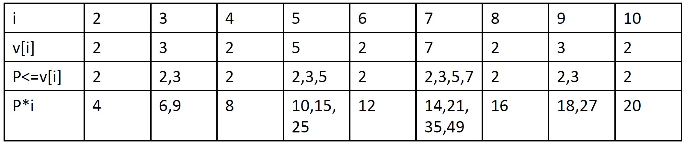

素数
####

.. toctree::
   :maxdepth: 2

素数判定
========
|  素数是指在一个大于1的自然数中，除了1和这个数本身，没法被其他自然数整除的数。
|  我们可以通过一下代码从2到sqrt(n)来判断n是否是素数：

.. code-block:: c++

    bool isPrime(int n)
    {
        if(n<2) return 0;
        else 
            for(int i=2;i*i<=n;i++)
                if(n%i==0) return 0;
        return 1;
    }

| ``素数分布密度``：每lnN个数中大约有1个质数。

Eratosthenes筛法
================
|   已知任意一个整数的倍数都不会是素数，例如2的倍数4、6、8都不是素数，所以我们可以从2开始扫描每一个数，将其倍数标记，如果一个数未被标记过，则它是素数。
|   这种算法有一个问题，一个数极有可能被重复标记，例如6会被2、3标记。 ``如果任意一个数a是x的整数倍数，则a=b*x，当b<x时，该数已被b标记过。`` 所以我们可以从 x\ :sup:`2`\ 开始标记x的倍数。
|   最终代码如下：

.. code-block:: c++

    int prime(int n)//计算2~n范围内的素数个数 
    {
        bool mark[100001];//素数为0，合数为1 
        memset(mark,0,sizeof(mark));
        int ans; //素数计数器 
        for(int i=2;i<=n;i++)//遍历2~n 
        {
            if(!mark[i])//如果没被标记过，则该数是素数，标记其倍数 
            {
                ans++;
                for(int j=i;j<=n/i;j++) mark[i*j]=1;//从i^2标记到n 
            }
        }
        return ans;
    }

线性筛法
======== 
|   即使我们已经进行了优化，Eratosthenes筛法仍会出现重复标记的情况，例如12会被2、3标记，因为我们没有确定唯一产生12的方法。
|   因此，我们以 ``合数=最小素数*一个数`` 来标记一个合数。
|   我们定义数组V来记录2~N之间每个数的最小质因子，对每个数进行如下操作：

- 从小到大遍历2~N中每个数i
- 当v[i]=0，i没有被任何数标记，i是素数，令v[i]=i
- 扫描小于等于v[i]的所有素数p，令v[i*p]=p

|   上述操作中，任何一个合数都是由一个 ``最小素数p`` * ``一个数i`` 得到的，没有数会被重复筛选，时间复杂度为 ``O(N)``